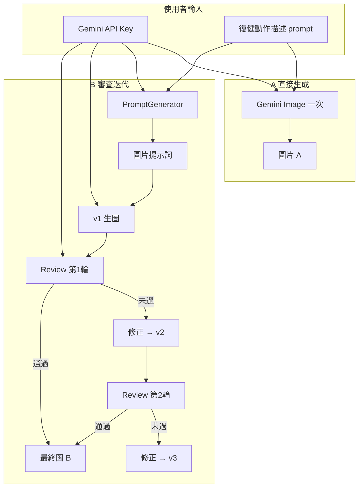

# 復健圖生成 Web Tool 規劃（A 直接生成 vs B 審查迭代）

> 版本：**v0.2**（依使用者需求修訂）  
> 撰寫依據：`raw_generate.py`（A）、`main.py` / `RehabilitationImageGenerator`（B）、`agents/*`、`config.py`  
> **範圍外**：`PictureReview/`（本工具不整合、不參考）

---

## 1. 產品定位

### 1.1 要做什麼

開放給**任意使用者**（各自持有 Gemini API Key）：

1. 在網頁**輸入自己的 API Key**（每人用自己的配額，部署端不必代管金鑰）。
2. 在網頁**輸入復健動作描述（prompt 原文）**（可選載入內建範例文字，但核心是自訂輸入）。
3. 對**同一份原文**分別跑：
   - **A**：原文直接送生圖模型（等同 `raw_generate.py` 單段邏輯）。
   - **B**：提示詞生成 → 生圖 → AI 審查 → 未過則修正迭代（等同 `RehabilitationImageGenerator.generate()`）。
4. **比較兩種流程下的成圖效果**；其中 **B 必須完整呈現**：
   - 每個階段產出的**圖片**（v1、v2、v3…）
   - 每一次 **Review 審查意見**（分數、issues、recommendations、summary、passed）

### 1.2 成功指標

| 指標 | 說明 |
|------|------|
| BYOK | 未在伺服器設定 `.env` 金鑰也能完成一次 A 或 B 生成 |
| 自訂 prompt | 主輸入為多行文字框；範例僅一鍵填入，非必選 PDF |
| A 結果 | 顯示最終圖 + 註明「生圖 prompt = 使用者原文」 |
| B 階段圖 | 時間軸上每個 `vN` 皆有可點開的大圖 |
| B 審查 | 每輪 review 顯示結構化意見（非僅最終 JSON 檔） |
| A/B 對照 | 同一輪輸入完成後，並排看 A 最終圖 vs B 最終圖 |

---

## 2. 現有程式對照（A / B）

### 2.1 A：直接生成

| 項目 | 內容 |
|------|------|
| 程式 | `raw_generate.py` → `generate_raw_image(prompt, output_prefix)` |
| 輸入 | **使用者輸入的全文** 直接作為生圖 prompt |
| 略過 | `PromptGenerator`、審查、修正 |
| 模型 | 固定 `gemini-3-pro-image-preview` |
| 產出 | 單張圖（Web 可用 job-scoped 暫存，不必寫死 CLI 檔名規則） |

### 2.2 B：審查迭代

| 項目 | 內容 |
|------|------|
| 程式 | `main.py` → `RehabilitationImageGenerator.generate()` |
| 輸入 | **使用者輸入的全文** → `PromptGenerator.process()` → 圖片提示詞 |
| 鏈路 | 生圖 v1 → `ImageReviewer.review` →（未過）`ImageRefiner.refine` → v2… |
| 迭代上限 | `config.MAX_ITERATIONS`（預設 3 次審查迴圈） |
| 產出 | 多張 `vN` 圖 + 每輪 review JSON + 最終 `image_prompt` |

### 2.3 使用者應看見的流程



---

## 3. 使用者自帶 API Key（BYOK）

### 3.1 原則

- **部署方不提供**共用 `GEMINI_API_KEY`；每人用自己的 [Google AI Studio](https://aistudio.google.com/app/apikey) 金鑰。
- 金鑰**只在本機瀏覽器暫存**（預設 `sessionStorage`），每次呼叫後端時以 **HTTP Header** 帶入。
- 後端**不寫入硬碟、不寫 log、不回傳**金鑰；Job 結束後記憶體清除。

### 3.2 前端

| 項目 | 設計 |
|------|------|
| 元件 | 密碼型輸入框 +「儲存於此瀏覽器分頁」說明 |
| 儲存 | `sessionStorage.setItem('gemini_api_key', …)`（關分頁即清） |
| 可選 | 「記住直到關閉瀏覽器」vs 僅本次工作階段 — 仍不用 `localStorage` 以降低外洩面 |
| 送出前 | 按鈕「驗證金鑰」→ `POST /api/validate-key`（輕量 list models 或最小 generate） |
| 缺少金鑰 | 禁用「開始生成」並提示 |

### 3.3 後端

| 項目 | 設計 |
|------|------|
| Header | `X-Gemini-Api-Key: <user_key>`（必填於 `/api/jobs`） |
| 注入方式 | 建議新增 `services/gemini_context.py`：`with user_api_key(key):` 內暫時覆寫傳入各 Agent 的 `genai.Client(api_key=…)` |
| 實作路徑 | **優先**：Webtool 封裝層建立 Agent 時傳入 `api_key` 參數（需小改 `agents/*.py` 的 `__init__` 接受 optional `api_key`，預設仍讀 `config` 給 CLI 用） |
| 啟動 | 後端 `.env` 的 `GEMINI_API_KEY` **改為可選**；Web 啟動時若無則不 `raise`，僅 BYOK 請求可跑 |
| 錯誤 | 401/403 時回傳「金鑰無效或無配額」，不洩漏 key |

### 3.4 安全提醒（UI 文案）

- 僅在信任的網址輸入金鑰；正式環境必須 **HTTPS**。
- 金鑰只送到你的後端，後端再轉呼叫 Google（勿在前端直接呼叫 Gemini 以免 CORS 與 key 暴露於 bundle）。

---

## 4. 輸入：使用者 Prompt（核心）

### 4.1 主介面

- **大型 textarea**（必填）：復健動作完整描述（結構化文字，與 CLI 輸入相同格式）。
- **字數 / 預估**提示；空內容不可送出。
- **可選**：「載入範例」下拉（2～3 段內建短文，來自 `Webtool/samples/example_prompts.json`，**非** PDF 批次流程）。

### 4.2 不納入 MVP

- PDF 拆段列表、動作名稱搜尋（`splitpdf` / `find_prompts_by_name`）— 若日後要加，僅作「範例來源」附加功能。

### 4.3 生成選項

| 選項 | 說明 |
|------|------|
| 模式 | `A`、`B`、`A+B 對照`（預設 A+B，**序列**執行：先 A 再 B） |
| `MAX_ITERATIONS` | 唯讀顯示預設 3；進階可下拉 1–3（傳入 B pipeline） |

---

## 5. B 流程 UI（審查意見 + 各階段圖片）— 重點

### 5.1 版面：垂直「階段卡片」時間軸

每一階段一張 **StageCard**，固定結構：

```
[圖示] 階段名稱 · 耗時 · 狀態
├─ 圖片區（若有）
├─ 文字區（prompt / 修正要求 / 審查摘要）
└─ 展開：完整 JSON（進階）
```

### 5.2 B 階段與必顯內容

| 順序 | 階段 ID | 顯示內容 |
|------|---------|----------|
| 1 | `prompt_generated` | **圖片提示詞**全文（摺疊預設 8 行）；標註「由語言模型從你的原文產生」 |
| 2 | `image_v1` | **v1 大圖** + 下載；無審查 |
| 3 | `review_1` | **審查意見**：`passed`、四維 **score**、`issues` / `errors`、`recommendations`、**summary** 段落 |
| 4 | `image_v2` | （僅當第 1 輪未過）**v2 大圖** + 簡述「依審查修正後重生」 |
| 5 | `review_2` | 第 2 輪審查（同上結構） |
| 6 | `image_v3` | （若仍有）v3 圖 |
| 7 | `review_3` | 第 3 輪審查 |
| 8 | `finished` | **最終採用圖**（最後一張 vN）、`final_passed`、總迭代次數 |

**規則**：

- 每一張 **vN 圖** 必須在 UI 上保留（縮圖列 + 點選放大），不可只顯示最終圖。
- 每一輪 **Review** 必須以**人類可讀**方式呈現（見 §5.3），不能只給 raw JSON 摺疊。
- `review_k` 卡片內嵌 **對應審查的那張圖**（`image_path` / base64）作為對照。

### 5.3 Review 卡片 UI 規格

對應 `image_reviewer.py` 回傳 JSON：

| 區塊 | 欄位 | 呈現 |
|------|------|------|
| 總覽 | `passed` | 綠「通過」/ 紅「需修正」badge |
| 總覽 | `summary` | 置頂摘要段落 |
| 分數 | `content_match.score` 等四項 | 橫向 bar 0–100 |
| 內容 | `content_match.issues[]` | 條列 |
| 文字 | `text_accuracy.errors[]` | 條列 |
| 視覺 | `visual_correctness.issues[]` | 條列 |
| 品質 | `overall_quality.comments[]` | 條列 |
| 建議 | `recommendations[]` | 編號清單（修正依據） |
| 進階 | 完整物件 | `<details>` 展開 JSON |

修正階段（`refine_start`）另卡：顯示 **Refiner 組出的修正要求**文字（來自 `ImageRefiner` / `refine_image` 的 feedback 摘要）。

### 5.4 A 流程 UI（對照用）

| 階段 | 內容 |
|------|------|
| `direct_generate` | 註明：未經 PromptGenerator / 未審查 |
| `image_raw` | 單張最終圖 |
| 對照欄 | 並排顯示「生圖輸入 = 你的原文」（可摺疊） |

### 5.5 A vs B 對照頁

完成後進入 **Compare** 視圖：

```
┌─────────────────────┬─────────────────────┐
│  A 直接生成          │  B 審查迭代          │
│  [最終圖]            │  [最終圖]            │
│  1 步 · ~1min        │  N 步 · ~數min       │
└─────────────────────┴─────────────────────┘
         下方：B 完整時間軸（§5.2 所有 StageCard）
```

---

## 6. 技術架構

### 6.1 總覽

```
┌──────────────────────────────────────────────────────────┐
│  Browser                                                  │
│  · API Key (sessionStorage) → Header X-Gemini-Api-Key    │
│  · Prompt textarea                                        │
│  · SSE 訂閱 /api/jobs/:id/events                         │
└────────────────────────────┬─────────────────────────────┘
                             │ REST + SSE
┌────────────────────────────▼─────────────────────────────┐
│  FastAPI (Webtool/backend)                                │
│  · 依 request 注入 user api_key                           │
│  · pipeline_a / pipeline_b + on_event → SSE               │
│  · 圖片存 Webtool/runtime/jobs/{job_id}/                  │
└────────────────────────────┬─────────────────────────────┘
                             │ import
              raw_generate.generate_raw_image
              RehabilitationImageGenerator (+ progress_callback)
              agents/*
```

### 6.2 技術版本

| 層級 | 技術 | 版本 |
|------|------|------|
| Python | 3.10+ | 與專案 venv 一致 |
| 後端 | FastAPI ≥0.115、uvicorn ≥0.30 | |
| 前端 | Vite + Vue 3 或 React 18 | 實作時定案 |
| UI | Tailwind CSS 3.4 | |
| SDK | google-genai | 根目錄 `requirements.txt` |

### 6.3 目錄結構

```
Webtool/
├── plan.md
├── backend/
│   ├── main.py
│   ├── routers/
│   │   ├── validate_key.py
│   │   ├── jobs.py
│   │   └── assets.py          # serve job 目錄內圖片
│   ├── services/
│   │   ├── gemini_context.py  # per-request api_key
│   │   ├── pipeline_a.py
│   │   ├── pipeline_b.py      # on_event → SSE payload
│   │   └── job_store.py
│   └── runtime/jobs/{job_id}/   # gitignore；圖+json
├── frontend/
│   └── src/
│       ├── components/
│       │   ├── ApiKeyForm.vue
│       │   ├── PromptEditor.vue
│       │   ├── StageCard.vue
│       │   ├── ReviewPanel.vue
│       │   └── CompareView.vue
│       └── pages/
│           └── Workbench.vue    # 單頁可涵蓋輸入+進度+結果
├── samples/
│   └── example_prompts.json
└── README.md
```

---

## 7. 後端 API

| Method | Path | 說明 |
|--------|------|------|
| POST | `/api/validate-key` | Header 帶 key；回 `{ valid: bool }` |
| POST | `/api/jobs` | body: `{ prompt: string, modes: ["a","b"] }` + Header key |
| GET | `/api/jobs/:id` | 完整狀態：A/B 結果、B `stages[]` 陣列 |
| GET | `/api/jobs/:id/events` | **SSE**：`stage_started` / `stage_completed` |
| GET | `/api/jobs/:id/assets/:filename` | 該 job 圖片 |
| DELETE | `/api/jobs/:id` | 刪除暫存（可選） |

### 7.1 SSE 事件（B 範例）

```json
{
  "job_id": "uuid",
  "pipeline": "b",
  "event": "stage_completed",
  "stage": "review_1",
  "data": {
    "passed": false,
    "summary": "…",
    "content_match": { "score": 72, "issues": ["…"] },
    "text_accuracy": { "score": 90, "errors": [] },
    "visual_correctness": { "score": 80, "issues": ["…"] },
    "overall_quality": { "score": 85, "comments": ["…"] },
    "recommendations": ["…"],
    "image_url": "/api/jobs/uuid/assets/v1.jpg"
  },
  "elapsed_ms": 42000
}
```

```json
{
  "event": "stage_completed",
  "stage": "image_v2",
  "pipeline": "b",
  "data": { "image_url": "/api/jobs/uuid/assets/v2.jpg", "version": 2 }
}
```

### 7.2 `generate()` 必要小改

在 `RehabilitationImageGenerator.generate()` 增加：

```python
progress_callback: Callable[[str, dict], None] | None = None
api_key: str | None = None  # 或由 gemini_context 注入
```

回呼時機與 `stage` 名稱對齊 §5.2（`prompt_generated`、`image_v1`、`review_1`…）。

---

## 8. 頁面 IA（精簡單頁優先）

```
/ 或 /workbench
├── 區塊 1：API Key 設定 + 驗證
├── 區塊 2：Prompt 輸入 + 範例按鈕
├── 區塊 3：模式 A / B / A+B · 開始
├── 區塊 4：進行中（A 簡條 + B 時間軸 StageCard，SSE 即時追加）
└── 區塊 5：完成後 Compare + B 完整歷程（可捲動）
```

不需獨立 `/settings` 管理員頁。

---

## 9. 實作階段

### Phase 0 — 骨架（2–3 天）

- [ ] FastAPI + 前端 scaffold
- [ ] `gemini_context` + Agent 可選 `api_key`
- [ ] `config.py` Web 模式：無伺服器 key 仍可啟動

### Phase 1 — 輸入與金鑰（2 天）

- [ ] `ApiKeyForm` + `validate-key`
- [ ] `PromptEditor` + `example_prompts.json`

### Phase 2 — Live A（2 天）

- [ ] `pipeline_a` + Job + 單圖顯示

### Phase 3 — Live B + 審查 UI（4–5 天）

- [ ] `progress_callback` 接 SSE
- [ ] **StageCard + ReviewPanel**（§5 全部欄位）
- [ ] 多版本圖片縮圖列

### Phase 4 — A+B 對照與收尾（2 天）

- [ ] 序列跑 A→B、Compare 視圖
- [ ] 錯誤處理、配額提示、README

**不包含**：PictureReview 整合、PDF 批次、展示模式無 API、伺服器代管金鑰。

---

## 10. 非功能需求

| 項目 | 要求 |
|------|------|
| 併發 | 預設每個後端實例同時 1 個生圖 Job（避免單機 quota 爆掉） |
| 暫存 | `runtime/jobs/` 定期清理（例如 >24h） |
| CORS | 僅允許設定之 frontend origin |
| 成本提示 | 送出前顯示：A≈1 次生圖；B≈1 language + 1–3 image + 1–3 vision |
| 隱私 | Job 不記錄 api_key；prompt 可選不持久化僅記 job 目錄 |

---

## 11. 測試計畫

| 類型 | 內容 |
|------|------|
| 單元 | `gemini_context`、assets path、ReviewPanel 資料映射 |
| 整合 | 短 prompt + 測試 key：A 出 1 圖；B 至少 v1 + review_1 |
| 手動 | B 未過時是否出現 v2 + review_2 卡片；圖與意見是否對應同一輪 |
| 安全 | log 中無 key 字串；關閉分頁後 sessionStorage 清空 |

---

## 12. 風險與對策

| 風險 | 對策 |
|------|------|
| 使用者怕洩漏 key | sessionStorage + HTTPS 說明；後端不落地 |
| B 太久 | SSE 心跳 + 每階段耗時 |
| 審查 JSON 解析失敗 | UI 顯示 raw + 流程標 failed |
| `config` 啟動必須有 key | Web 啟動改 optional，CLI 仍可在無 Web 時要求 key |

---

## 13. 決策紀錄（v0.2）

| 議題 | 決策 |
|------|------|
| API Key | **使用者輸入 BYOK**，Header 傳後端 |
| 輸入來源 | **自訂 prompt 為主**；範例 JSON 為輔 |
| PictureReview | **不考量** |
| B 展示 | **每階段圖 + 每輪 Review 意見**（§5） |
| 展示模式無 API | **不做**（無 key 無法體驗真實流程） |
| 產出位置 | `Webtool/runtime/jobs/{job_id}/`，不污染父專案 `output/` |

---

## 14. 程式錨點

| 功能 | 檔案 |
|------|------|
| A | `raw_generate.py` → `generate_raw_image()` |
| B | `main.py` → `RehabilitationImageGenerator.generate()` |
| 審查 JSON 結構 | `agents/image_reviewer.py` → `create_review_prompt()` / `review()` |
| 修正 | `agents/image_refiner.py` |
| 流程說明 | `Method說明/復健圖生成流程_A_直接生成_vs_B_審查迭代.md` |

---

*下一步：Phase 0 實作 `gemini_context` + `POST /api/jobs` 骨架，並在前端完成 API Key + Prompt 輸入區塊。*
